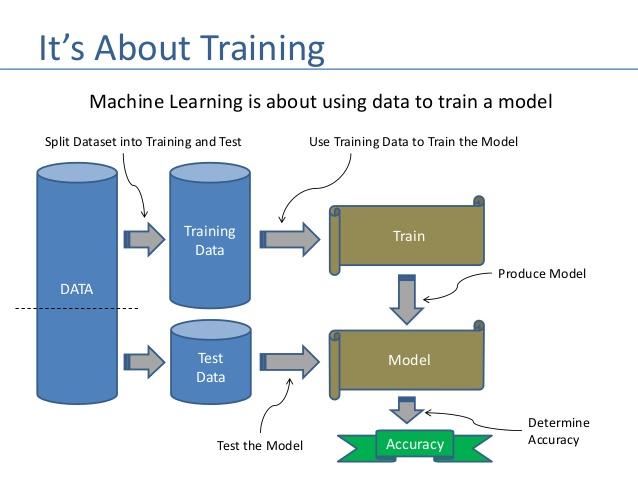

# MachineLearningUsingPython

### What is Machine Learning?

- Machine learning is a form of Artifical intelligence (AI) that enables a system to learn from data rather than through explicit       programming.
- ML uses a variety of algorithms that iteratively learn from data to improve, describe data, and predict outcomes.

### Why do we need Machine Learning?
__A) Continuous Learning and Improvement__:
    Unlike human which has tendency to keep on learning from its mistakes. ML also develop the model which will continuously learn by its intelligence and keep on improving without being programmed.

__B) Reduce Mundane Work__:
    The tasks which are repetitive, boring, unproductive and yet necessary. Those tasks can be done by Machine.

__C) Reduces Error and improved efficiency__:
    Human has tendency to do mistakes while doing work but machine can do same work with small/negligible amount of mistake which in turns increase overall efficiency.

__D) Higher Productivity__:  
    Machine don't need sleep and breaks from work. Machine can work 24*7 which in turn makes machines more productive than humans. 

### How machine can learn?

Machines are good at following things:

- Machines are good in numbers specially 0 and 1
- Machines are good in mathematical calculations
- Machines are good in remembering the past with the storage device

So we will make use of above features and make machines to learn from the data.

### How to test whether machine has learnt or not?

Below is the basic rule that needs to be followed in order to identify that machine had actually learnt or not.

- Train machine with the portion of data – Normally its 70%
- Test machine with the remaining set of data – Remaining 30%
- Measure the accuracy of the result by comparing the actual result generated by the machine with the expected result which is already present.

This is called as __“Train-Test Cycle”__.

## Repository Overview
This repository contains information regarding the different ML projects done in Python language

## Table of Contents
- [Exploratory Data Analysis (EDA) on Movies Dataset](#section01)  

## [Exploratory Data Analysis (EDA) on Movies Dataset](../EDA On Movies Dataset)

- A film, also called a movie, motion picture, moving picture, or photoplay, is a series of still images that, when shown on a screen, create the illusion of moving images. 
- Exploratory Data Analysis is carried out on Movies data set in order to make some sense out of the data and tell some conclusions in order to grow the business. 
- [Jupyter Notebook of Movies Data EDA](../EDA On Movies Dataset/Movies_EDA_Project.ipynb)
